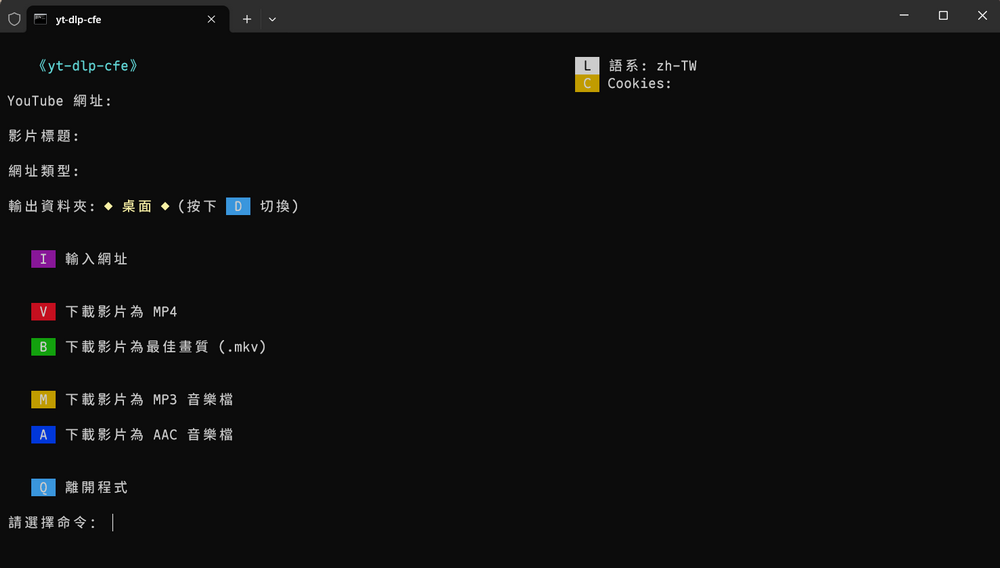
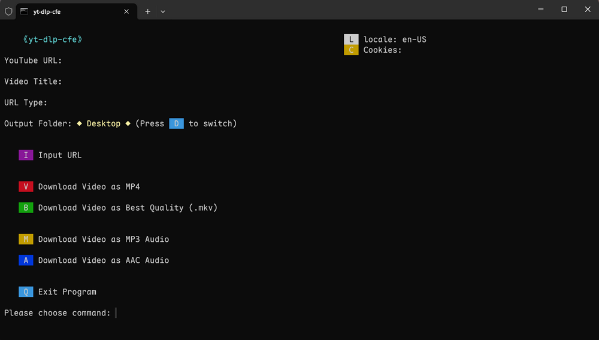

# yt-dlp-cfe

## 繁體中文

一個使用 Windows 命令列的 [yt-dlp](https://github.com/yt-dlp/yt-dlp) 前端，內建 [ffmpeg](https://ffmpeg.org/)，目前使用版本：

* [yt-dlp 2026.01.31](https://github.com/yt-dlp/yt-dlp/releases/tag/2025.01.29)
* [ffmpeg 8.0.1 binary from gyan.dev](https://www.gyan.dev/ffmpeg/builds/)

如果影片無法下載，請安裝 [Deno](https://deno.com/)，請在 Windows PowerShell 管理員模式下，輸入以下指令，即可安裝完成：

```bash
irm https://deno.land/install.ps1 | iex
```

## 圖示

圖示由 Freepik 提供（[Flaticon](https://www.flaticon.com/free-icons/video)）

## 程式截圖



## English

A [yt-dlp](https://github.com/yt-dlp/yt-dlp) Windows command-line frontend with build-in [ffmpeg](https://ffmpeg.org/), currently using version:

* [yt-dlp 2026.01.31](https://github.com/yt-dlp/yt-dlp/releases/tag/2025.01.29)
* [ffmpeg 8.0.1 binary from gyan.dev](https://www.gyan.dev/ffmpeg/builds/)

If the video cannot be downloaded, please install [Deno](https://deno.com/). Open Windows PowerShell as Administrator, then enter the following command to complete the installation:

```bash
irm https://deno.land/install.ps1 | iex
```

## Icon

Icon created by Freepik - [Flaticon](https://www.flaticon.com/free-icons/video)

## Screenshot


